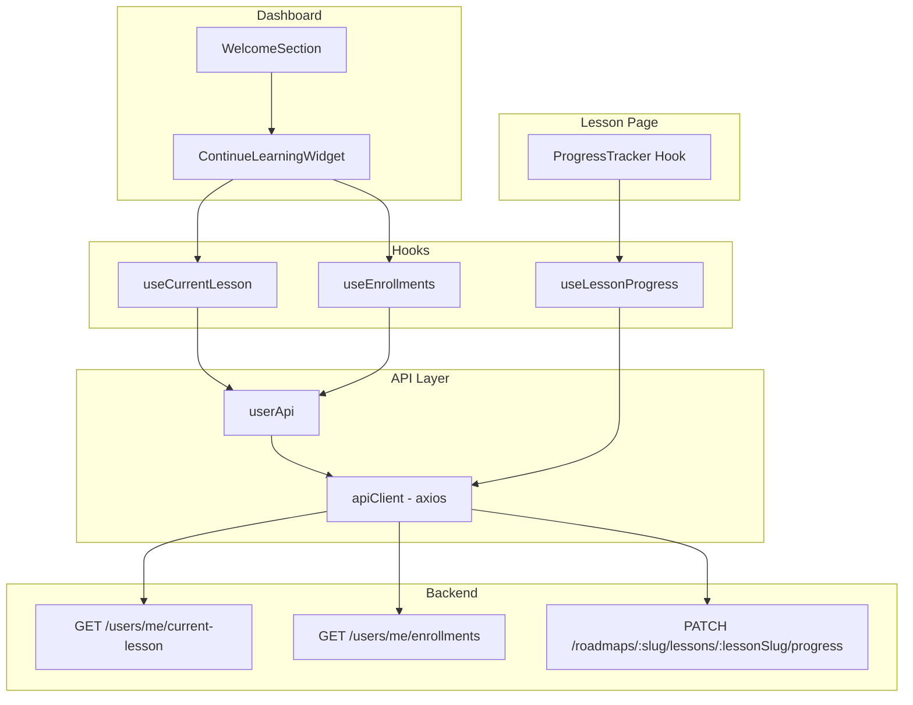

# Design Document: Continue Lesson

## Overview

The "Continue Lesson" feature enables learners to seamlessly resume their learning from the Dashboard. It consists of three main capabilities:

1. **Auto-mark IN_PROGRESS**: When a learner opens a lesson page, the system automatically marks it as IN_PROGRESS (if it was NOT_STARTED), enabling accurate progress tracking.
2. **Current Lesson API integration**: A new `GET /users/me/current-lesson` endpoint provides the most recently accessed in-progress lesson, consumed by the Dashboard widget.
3. **Continue Learning Widget**: Replaces the hardcoded welcome subtitle on the Dashboard with real-time progress data and a one-click resume button.

The feature integrates with the existing SWR-based data fetching layer, the `useRoadmapActions` hook for progress mutations, and the existing PATCH endpoint for lesson progress updates.

## Architecture



### Data Flow

1. **Lesson Page opens** → `useAutoMarkInProgress` hook checks current progress → if `NOT_STARTED`, fires PATCH to mark `IN_PROGRESS` (fire-and-forget, non-blocking)
2. **Dashboard loads** → `useCurrentLesson` hook calls `GET /users/me/current-lesson` via SWR → widget renders lesson info + progress bar
3. **User clicks "Tiếp tục học"** → Next.js router navigates to `/learn/{roadmapSlug}/{lessonSlug}`

## Components and Interfaces

### New API Functions (`api/user.ts`)

```typescript
import { apiClient } from "@/api/api-client";
import type { ApiResponse } from "@/lib/types/api";
import type { CurrentLessonResponse, EnrollmentListItem } from "@/lib/types/user";

export const userApi = {
  getCurrentLesson: async (): Promise<CurrentLessonResponse | null> => {
    const response = await apiClient.get<ApiResponse<CurrentLessonResponse>>(
      "/users/me/current-lesson"
    );
    // Backend returns 204 for no current lesson
    if (response.status === 204) return null;
    return response.data.data;
  },

  getEnrollments: async (): Promise<EnrollmentListItem[]> => {
    const response = await apiClient.get<ApiResponse<EnrollmentListItem[]>>(
      "/users/me/enrollments"
    );
    return response.data.data;
  },
};
```

### New Hook: `useCurrentLesson` (`hooks/use-current-lesson.ts`)

```typescript
import useSWR from "swr";
import { fetcher } from "@/api/fetchers";
import type { CurrentLessonResponse } from "@/lib/types/user";

export function useCurrentLesson() {
  const { data, error, isLoading, mutate } = useSWR<CurrentLessonResponse | null>(
    "/users/me/current-lesson",
    fetcher,
    {
      revalidateOnFocus: false,
      shouldRetryOnError: false,
      errorRetryCount: 1,
      errorRetryInterval: 3000,
      loadingTimeout: 5000,
    }
  );

  return {
    currentLesson: data,
    isLoading,
    isError: !!error,
    retry: mutate,
  };
}
```

### New Hook: `useAutoMarkInProgress` (`hooks/use-auto-mark-progress.ts`)

```typescript
import { useEffect, useRef } from "react";
import type { ProgressStatus } from "@/lib/types/roadmap";
import { roadmapApi } from "@/api/roadmap";

/**
 * Automatically marks a lesson as IN_PROGRESS when the page loads,
 * only if the current status is NOT_STARTED.
 * Fire-and-forget: errors are silently ignored.
 */
export function useAutoMarkInProgress(
  roadmapSlug: string,
  lessonSlug: string,
  currentProgress: ProgressStatus | null | undefined
) {
  const hasFired = useRef(false);

  useEffect(() => {
    if (hasFired.current) return;
    if (currentProgress !== "NOT_STARTED") return;

    hasFired.current = true;

    // Fire-and-forget: don't await, don't show errors
    roadmapApi
      .updateLessonProgress(roadmapSlug, lessonSlug, "IN_PROGRESS")
      .catch(() => {
        // Silently ignore - user can still view content
      });
  }, [roadmapSlug, lessonSlug, currentProgress]);
}
```

### Updated Component: `WelcomeSection` (`components/dashboard/welcome-section.tsx`)

The existing `WelcomeSection` will be refactored to consume real data from `useCurrentLesson`:

```typescript
"use client";

import { useUser } from "@/hooks/use-user";
import { useCurrentLesson } from "@/hooks/use-current-lesson";
import { Button } from "@/components/ui/button";
import { Skeleton } from "@/components/ui/skeleton";
import Link from "next/link";

export function WelcomeSection() {
  const { user } = useUser();
  const { currentLesson, isLoading, isError } = useCurrentLesson();

  // Subtitle logic
  let subtitle: React.ReactNode;
  let ctaHref: string = "/roadmaps";

  if (isLoading) {
    subtitle = <Skeleton className="h-4 w-64" />;
  } else if (isError || !currentLesson) {
    subtitle = currentLesson === undefined && isError
      ? "Chào mừng bạn trở lại"
      : "Bắt đầu hành trình học thuật toán ngay hôm nay";
  } else {
    subtitle = `Tiếp tục hành trình trong ${currentLesson.roadmapName} — bạn đã hoàn thành ${currentLesson.completionPercentage}%`;
    ctaHref = `/learn/${currentLesson.roadmapSlug}/${currentLesson.lessonSlug}`;
  }

  return (
    <div className="flex flex-col gap-1.5">
      <h1 className="text-2xl font-bold tracking-tight">
        Welcome back, {user?.username}
      </h1>
      <p className="text-sm text-muted-foreground">{subtitle}</p>
      <Link href={ctaHref}>
        <Button size="sm" className="mt-2 w-fit">
          Tiếp tục học
        </Button>
      </Link>
    </div>
  );
}
```

### New Component: `ContinueLearningWidget` (optional expanded view)

If the Dashboard needs a richer widget beyond the welcome section subtitle, a dedicated card component can be added to show progress bar and lesson details. The `WelcomeSection` handles the primary requirement.

## Data Models

### New Types (`lib/types/user.ts`)

```typescript
export interface CurrentLessonResponse {
  roadmapSlug: string;
  lessonSlug: string;
  lessonTitle: string;
  roadmapName: string;
  completionPercentage: number; // 0-100 integer
}

export interface EnrollmentListItem {
  roadmapName: string;
  roadmapSlug: string;
  completionPercentage: number; // 0-100 integer
  nextLessonSlug: string | null;
  nextLessonTitle: string | null;
}
```

### API Response Contract

**GET /users/me/current-lesson**

Success (200):
```json
{
  "success": true,
  "data": {
    "roadmapSlug": "dsa-beginner",
    "lessonSlug": "arrays-introduction",
    "lessonTitle": "Introduction to Arrays",
    "roadmapName": "DSA for Beginners",
    "completionPercentage": 42
  }
}
```

No current lesson (204): Empty body

Unauthorized (401):
```json
{
  "success": false,
  "message": "Unauthorized"
}
```

**GET /users/me/enrollments**

Success (200):
```json
{
  "success": true,
  "data": [
    {
      "roadmapName": "DSA for Beginners",
      "roadmapSlug": "dsa-beginner",
      "completionPercentage": 42,
      "nextLessonSlug": "arrays-introduction",
      "nextLessonTitle": "Introduction to Arrays"
    }
  ]
}
```

Empty enrollments (200):
```json
{
  "success": true,
  "data": []
}
```

## Correctness Properties

*A property is a characteristic or behavior that should hold true across all valid executions of a system — essentially, a formal statement about what the system should do. Properties serve as the bridge between human-readable specifications and machine-verifiable correctness guarantees.*

### Property 1: Progress update fires only for NOT_STARTED

*For any* ProgressStatus value (NOT_STARTED, IN_PROGRESS, COMPLETED, or null), the auto-mark logic SHALL trigger a PATCH request if and only if the status equals "NOT_STARTED".

**Validates: Requirements 1.1, 1.2, 1.3, 1.5**

### Property 2: Widget renders all required fields from API response

*For any* valid `CurrentLessonResponse` object containing a roadmapName, lessonTitle, and completionPercentage, the rendered WelcomeSection SHALL include the roadmapName string and the completionPercentage value in its output text.

**Validates: Requirements 3.1, 3.6**

### Property 3: Welcome text formatting with dynamic data

*For any* roadmap name (non-empty string) and completion percentage (integer 0–100), the formatted subtitle text SHALL contain both the exact roadmap name and the exact percentage value in the pattern "Tiếp tục hành trình trong {name} — bạn đã hoàn thành {pct}%".

**Validates: Requirements 5.1**

### Property 4: Most recent enrollment selection

*For any* non-empty list of enrollments with distinct `updatedAt` timestamps, the widget SHALL select and display the enrollment whose `updatedAt` timestamp is the most recent (maximum value).

**Validates: Requirements 5.3**

### Property 5: CTA lesson selection logic

*For any* list of lessons with varying ProgressStatus values, the CTA link SHALL point to the first lesson (by displayOrder) with status "IN_PROGRESS"; if no IN_PROGRESS lesson exists, it SHALL point to the first lesson with status "NOT_STARTED".

**Validates: Requirements 5.4**

## Error Handling

| Scenario | Behavior |
|----------|----------|
| PATCH to mark IN_PROGRESS fails | Silently ignored; lesson content renders normally |
| `GET /users/me/current-lesson` returns 204 | Widget shows "Bắt đầu hành trình học thuật toán ngay hôm nay" with link to `/roadmaps` |
| `GET /users/me/current-lesson` returns 4xx/5xx | Widget shows "Chào mừng bạn trở lại" fallback; retries once after 3s |
| `GET /users/me/current-lesson` times out (>5s) | Same as network error — fallback text with link to `/roadmaps` |
| Retry also fails | Widget stays in fallback state; no further retries |
| `GET /users/me/enrollments` fails | Enrollments section shows fallback or is hidden; other Dashboard components unaffected |
| User not authenticated (401) | Handled by existing apiClient interceptor (redirect to login) |

### Resilience Principles

1. **Non-blocking rendering**: The `useAutoMarkInProgress` hook fires asynchronously and never blocks page render.
2. **Component isolation**: The WelcomeSection/ContinueLearningWidget renders independently via SWR's built-in suspense-free pattern. Other Dashboard components (StatsGrid, RecentProblemsCard, etc.) are not affected by its loading/error state.
3. **Bounded retries**: SWR's `errorRetryCount: 1` with `errorRetryInterval: 3000` ensures exactly one retry after 3 seconds, then stops.
4. **Graceful degradation**: Every error state has a meaningful fallback message that still provides navigation options.

## Testing Strategy

### Unit Tests (Example-based)

- **useAutoMarkInProgress**: Verify PATCH is called for NOT_STARTED, not called for IN_PROGRESS/COMPLETED/null; verify errors are swallowed silently
- **WelcomeSection rendering states**: Loading skeleton, success with data, empty response fallback, error fallback
- **Navigation**: Continue button navigates to correct `/learn/{roadmapSlug}/{lessonSlug}` URL
- **Retry behavior**: Verify exactly one retry after 3s delay on failure, no further retries after second failure
- **Timeout handling**: Verify fallback text appears after 5s timeout

### Property-Based Tests

Property-based testing is appropriate for this feature because the core logic involves:
- Conditional decision-making based on status values (pure function behavior)
- Text formatting with variable inputs
- Selection algorithms over lists with ordering

**Library**: [fast-check](https://github.com/dubzzz/fast-check) (already standard for TypeScript PBT)

**Configuration**:
- Minimum 100 iterations per property test
- Each test tagged with: `Feature: continue-lesson, Property {N}: {description}`

**Properties to implement**:
1. Progress update conditional logic (Property 1)
2. Widget field rendering completeness (Property 2)
3. Subtitle text formatting correctness (Property 3)
4. Most-recent enrollment selection (Property 4)
5. CTA lesson link selection (Property 5)

### Integration Tests

- **API contract tests**: Verify `GET /users/me/current-lesson` and `GET /users/me/enrollments` response shapes match TypeScript interfaces
- **End-to-end flow**: Open lesson → verify IN_PROGRESS marked → navigate to Dashboard → verify widget shows that lesson
- **SWR cache invalidation**: After marking a lesson complete, verify the current-lesson endpoint returns updated data on next Dashboard visit
