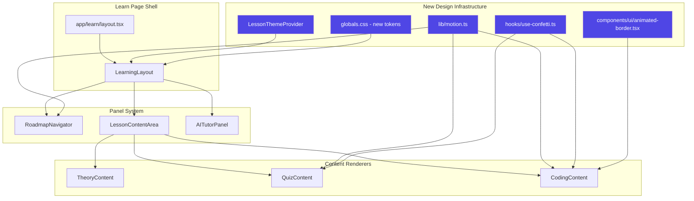
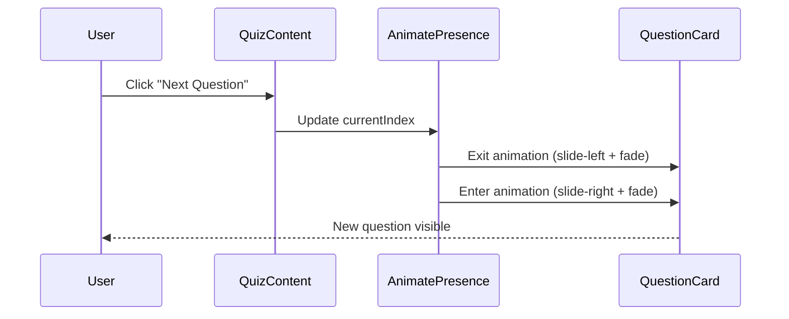
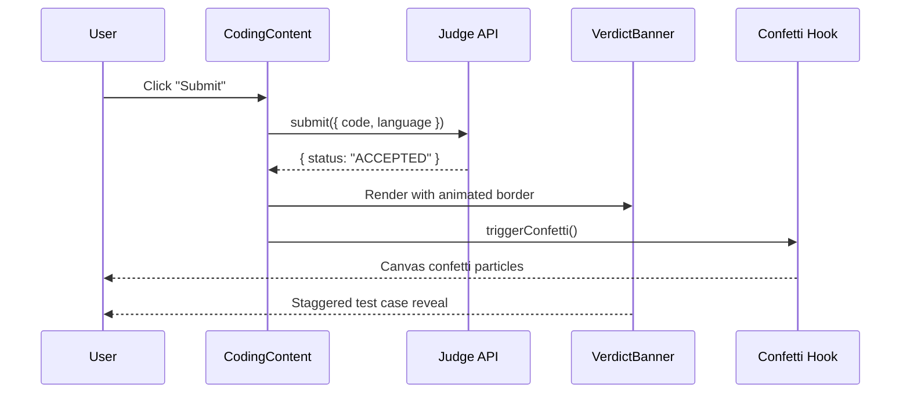
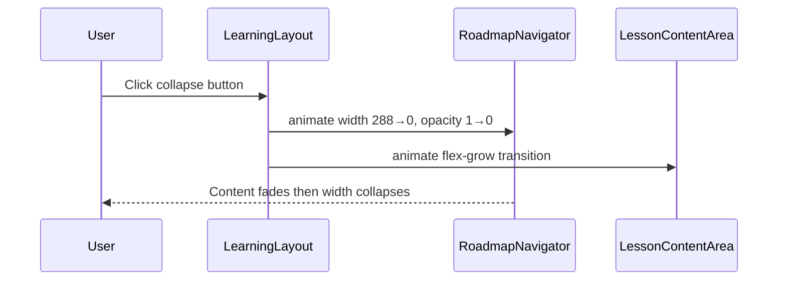

# Design Document: Learn Page Design Improvements

## Overview

This design covers a comprehensive UI/UX enhancement of the AlgoTutor Learn page section, targeting seven improvement areas: typography, lesson-type color coding, motion & micro-interactions, spatial composition, backgrounds & visual atmosphere, component-specific refinements, and accessibility fixes. The aesthetic direction is "Refined Developer Studio" — inspired by modern IDEs (Zed, Cursor) combined with editorial typography, with dark mode as the primary experience, subtle neon accents, monospace details, layered depth, and snappy spring-physics animations.

The implementation introduces a shared animation/motion system via Framer Motion, a lesson-type theming context, new CSS custom properties for color coding, and targeted component upgrades that preserve the existing architecture while layering in visual polish. All changes are additive and backward-compatible with the current component API surface.

## Architecture



## Sequence Diagrams

### Quiz Question Transition Flow



### Verdict Celebration Flow



### Navigator Collapse Animation



## Components and Interfaces

### Component 1: LessonThemeProvider

**Purpose**: Provides lesson-type color tokens as CSS custom properties and React context so child components can access the current lesson's accent color without prop drilling.

```typescript
// components/learn/lesson-theme-provider.tsx

type LessonAccent = "theory" | "quiz" | "coding";

interface LessonThemeContextValue {
  accent: LessonAccent;
  colors: {
    primary: string;      // CSS variable reference
    primaryMuted: string; // 10% opacity variant
    primaryBorder: string;// 30% opacity variant
  };
}

interface LessonThemeProviderProps {
  lessonType: LessonType;
  children: React.ReactNode;
}
```

**Responsibilities**:
- Map `LessonType` → accent color tokens
- Inject CSS custom properties via inline style on wrapper div
- Expose context for components needing programmatic access

### Component 2: Motion Utilities Module

**Purpose**: Centralized animation variants and spring configs for consistent motion across all Learn page components.

```typescript
// lib/motion.ts

import { type Variants, type Transition } from "framer-motion";

// Spring presets matching "snappy" aesthetic
export const springs = {
  snappy: { type: "spring", stiffness: 500, damping: 30 } as Transition,
  gentle: { type: "spring", stiffness: 300, damping: 25 } as Transition,
  bounce: { type: "spring", stiffness: 400, damping: 15 } as Transition,
} as const;

// Slide variants for quiz question transitions
export const slideVariants: Variants = {
  enter: (direction: number) => ({
    x: direction > 0 ? 300 : -300,
    opacity: 0,
    scale: 0.95,
  }),
  center: {
    x: 0,
    opacity: 1,
    scale: 1,
  },
  exit: (direction: number) => ({
    x: direction < 0 ? 300 : -300,
    opacity: 0,
    scale: 0.95,
  }),
};

// Stagger container for test case results
export const staggerContainer: Variants = {
  hidden: { opacity: 0 },
  show: {
    opacity: 1,
    transition: { staggerChildren: 0.08, delayChildren: 0.2 },
  },
};

export const staggerItem: Variants = {
  hidden: { opacity: 0, y: 12 },
  show: { opacity: 1, y: 0 },
};

// Scale pop for answer selection
export const scalePop: Variants = {
  idle: { scale: 1 },
  selected: { scale: [1, 1.03, 1], transition: { duration: 0.2 } },
};

// Fade for sidebar collapse
export const fadeVariants: Variants = {
  visible: { opacity: 1, transition: { duration: 0.15 } },
  hidden: { opacity: 0, transition: { duration: 0.1 } },
};
```

**Responsibilities**:
- Single source of truth for all animation timing
- Consistent spring physics across components
- Direction-aware slide transitions

### Component 3: useConfetti Hook

**Purpose**: Triggers canvas-based confetti celebrations on ACCEPTED verdicts and quiz pass events.

```typescript
// hooks/use-confetti.ts

interface ConfettiOptions {
  particleCount?: number;
  spread?: number;
  origin?: { x: number; y: number };
  colors?: string[];
}

interface UseConfettiReturn {
  triggerConfetti: (options?: ConfettiOptions) => void;
  triggerCelebration: () => void; // Full celebration sequence
}

export function useConfetti(): UseConfettiReturn;
```

**Responsibilities**:
- Lazy-load `canvas-confetti` library
- Provide preset celebration sequences (burst, rain, sides)
- Clean up canvas on unmount

### Component 4: AnimatedBorder

**Purpose**: Renders an animated gradient border effect for ACCEPTED verdict banners and solved badges.

```typescript
// components/ui/animated-border.tsx

interface AnimatedBorderProps {
  children: React.ReactNode;
  active?: boolean;
  colors?: string[];
  speed?: "slow" | "normal" | "fast";
  borderRadius?: string;
  className?: string;
}
```

**Responsibilities**:
- CSS `@property` animated conic gradient border
- Performant (GPU-composited via `transform` and `opacity`)
- Graceful degradation when `prefers-reduced-motion` is set

## Data Models

### Lesson Theme Token Map

```typescript
// lib/lesson-theme.ts

export const LESSON_THEME_MAP = {
  THEORY: {
    accent: "theory" as const,
    hue: 230,           // Indigo
    cssVars: {
      "--lesson-accent": "oklch(0.65 0.18 250)",
      "--lesson-accent-muted": "oklch(0.65 0.18 250 / 10%)",
      "--lesson-accent-border": "oklch(0.65 0.18 250 / 30%)",
      "--lesson-accent-glow": "oklch(0.65 0.18 250 / 20%)",
    },
  },
  QUIZ: {
    accent: "quiz" as const,
    hue: 45,            // Amber/Gold
    cssVars: {
      "--lesson-accent": "oklch(0.75 0.16 80)",
      "--lesson-accent-muted": "oklch(0.75 0.16 80 / 10%)",
      "--lesson-accent-border": "oklch(0.75 0.16 80 / 30%)",
      "--lesson-accent-glow": "oklch(0.75 0.16 80 / 20%)",
    },
  },
  CODING: {
    accent: "coding" as const,
    hue: 145,           // Emerald
    cssVars: {
      "--lesson-accent": "oklch(0.72 0.18 145)",
      "--lesson-accent-muted": "oklch(0.72 0.18 145 / 10%)",
      "--lesson-accent-border": "oklch(0.72 0.18 145 / 30%)",
      "--lesson-accent-glow": "oklch(0.72 0.18 145 / 20%)",
    },
  },
} as const;

export type LessonThemeConfig = (typeof LESSON_THEME_MAP)[keyof typeof LESSON_THEME_MAP];
```

**Validation Rules**:
- Theme tokens must use OKLCH color space (consistent with existing design system)
- All opacity variants derived from base accent color
- Hue values must be within 0-360 range

### Animation Configuration

```typescript
// lib/animation-config.ts

export interface AnimationConfig {
  /** Whether to respect prefers-reduced-motion */
  respectMotionPreference: boolean;
  /** Global animation speed multiplier (1 = normal) */
  speedMultiplier: number;
  /** Enable confetti celebrations */
  enableCelebrations: boolean;
}

export const DEFAULT_ANIMATION_CONFIG: AnimationConfig = {
  respectMotionPreference: true,
  speedMultiplier: 1,
  enableCelebrations: true,
};
```

## Algorithmic Pseudocode

### Quiz Question Transition Algorithm

```typescript
// Inside QuizContent — managing directional slide transitions

function QuizQuestionsView({ quiz, answers, onAnswer, onSubmit }: Props) {
  const [currentIndex, setCurrentIndex] = useState(0);
  const [direction, setDirection] = useState(0); // -1 = prev, +1 = next

  const navigateTo = (targetIndex: number) => {
    setDirection(targetIndex > currentIndex ? 1 : -1);
    setCurrentIndex(targetIndex);
  };

  return (
    <AnimatePresence mode="wait" custom={direction}>
      <motion.div
        key={currentIndex}
        custom={direction}
        variants={slideVariants}
        initial="enter"
        animate="center"
        exit="exit"
        transition={springs.snappy}
      >
        <QuestionCard
          question={quiz.questions[currentIndex]}
          selectedIds={answers[quiz.questions[currentIndex].id] ?? []}
          onAnswer={onAnswer}
        />
      </motion.div>
    </AnimatePresence>
  );
}
```

**Preconditions:**
- `currentIndex` is within bounds [0, quiz.questions.length - 1]
- `direction` is set before `currentIndex` updates (to avoid flash)

**Postconditions:**
- Only one question card is visible at any time
- Exit animation completes before enter animation starts (`mode="wait"`)
- Direction determines slide direction (left/right)

**Loop Invariants:** N/A (event-driven, not iterative)

### Staggered Test Case Reveal Algorithm

```typescript
// Inside JudgeResultsPanel — staggered reveal of test results

function StaggeredResults({ results }: { results: TestResult[] }) {
  return (
    <motion.div
      variants={staggerContainer}
      initial="hidden"
      animate="show"
    >
      {results.map((tc, i) => (
        <motion.div key={i} variants={staggerItem}>
          <TestCaseResult result={tc} index={i} />
        </motion.div>
      ))}
    </motion.div>
  );
}
```

**Preconditions:**
- `results` array is non-empty
- Parent component has mounted (animation triggers on mount)

**Postconditions:**
- Each test case appears 80ms after the previous one
- All items visible after `results.length * 80 + 200`ms
- No layout shift during reveal (items occupy space from start)

### Confetti Celebration Sequence

```typescript
// hooks/use-confetti.ts — celebration trigger logic

async function triggerCelebration() {
  const confetti = await import("canvas-confetti").then(m => m.default);

  // Burst from center
  confetti({
    particleCount: 80,
    spread: 70,
    origin: { y: 0.6 },
    colors: ["#10b981", "#34d399", "#6ee7b7", "#a7f3d0"],
  });

  // Delayed side bursts
  await delay(150);
  confetti({
    particleCount: 40,
    angle: 60,
    spread: 55,
    origin: { x: 0, y: 0.65 },
  });
  confetti({
    particleCount: 40,
    angle: 120,
    spread: 55,
    origin: { x: 1, y: 0.65 },
  });
}
```

**Preconditions:**
- Verdict is "ACCEPTED" or quiz `passed === true`
- `enableCelebrations` config is true
- `prefers-reduced-motion` is not set to "reduce"

**Postconditions:**
- Confetti particles render on a temporary canvas overlay
- Canvas auto-cleans after particles settle (~3s)
- No DOM pollution (canvas removed after animation)

### Navigator Collapse with Content Fade

```typescript
// Inside LearningLayout — improved collapse behavior

function NavigatorPanel({ open, children }: { open: boolean; children: React.ReactNode }) {
  return (
    <motion.div
      animate={{
        width: open ? 288 : 0,
        opacity: open ? 1 : 0,
      }}
      transition={{
        width: { ...springs.snappy, delay: open ? 0.05 : 0 },
        opacity: { duration: open ? 0.2 : 0.1, delay: open ? 0 : 0 },
      }}
      className="overflow-hidden border-r border-border/50 bg-card"
    >
      <motion.div
        animate={{ opacity: open ? 1 : 0 }}
        transition={{ duration: 0.1 }}
      >
        {children}
      </motion.div>
    </motion.div>
  );
}
```

**Preconditions:**
- `open` state is toggled by collapse button click
- Children are always mounted (for smooth re-open)

**Postconditions:**
- On collapse: content fades first (100ms), then width animates to 0
- On expand: width animates first, then content fades in (staggered)
- No content overflow during transition

## Key Functions with Formal Specifications

### Function 1: getLessonThemeVars()

```typescript
function getLessonThemeVars(lessonType: LessonType): Record<string, string>
```

**Preconditions:**
- `lessonType` is one of "THEORY" | "QUIZ" | "CODING"

**Postconditions:**
- Returns object with keys: `--lesson-accent`, `--lesson-accent-muted`, `--lesson-accent-border`, `--lesson-accent-glow`
- All values are valid OKLCH color strings
- Return value is referentially stable for same input (memoizable)

### Function 2: useReducedMotion()

```typescript
function useReducedMotion(): boolean
```

**Preconditions:**
- Called within a React component (hook rules)

**Postconditions:**
- Returns `true` if user has `prefers-reduced-motion: reduce` set
- Updates reactively if system preference changes
- SSR-safe (defaults to `false` on server)

### Function 3: getProgressShimmerClass()

```typescript
function getProgressShimmerClass(isLoading: boolean): string
```

**Preconditions:**
- `isLoading` is a boolean

**Postconditions:**
- Returns Tailwind class string with shimmer animation when `isLoading === true`
- Returns empty string when `isLoading === false`
- Shimmer uses `background-size` animation (GPU-composited)

### Function 4: calculateQuizTimerUrgency()

```typescript
function calculateQuizTimerUrgency(
  elapsedSeconds: number,
  questionCount: number
): "normal" | "warning" | "urgent"
```

**Preconditions:**
- `elapsedSeconds >= 0`
- `questionCount > 0`

**Postconditions:**
- Returns "normal" when elapsed < questionCount * 30 (30s/question baseline)
- Returns "warning" when elapsed >= questionCount * 30 and < questionCount * 60
- Returns "urgent" when elapsed >= questionCount * 60
- Timer color changes: normal=muted, warning=amber, urgent=rose

## Example Usage

```typescript
// Example 1: Wrapping lesson content with theme provider
import { LessonThemeProvider } from "@/components/learn/lesson-theme-provider";

<LessonThemeProvider lessonType="QUIZ">
  <QuizContent quiz={quiz} ... />
</LessonThemeProvider>

// Example 2: Using motion variants for quiz transitions
import { motion, AnimatePresence } from "framer-motion";
import { slideVariants, springs } from "@/lib/motion";

<AnimatePresence mode="wait" custom={direction}>
  <motion.div
    key={currentIndex}
    custom={direction}
    variants={slideVariants}
    initial="enter"
    animate="center"
    exit="exit"
    transition={springs.snappy}
  >
    <QuestionCard question={currentQuestion} />
  </motion.div>
</AnimatePresence>

// Example 3: Triggering confetti on ACCEPTED
import { useConfetti } from "@/hooks/use-confetti";

const { triggerCelebration } = useConfetti();

if (response.status === "ACCEPTED") {
  triggerCelebration();
}

// Example 4: Animated border on verdict banner
import { AnimatedBorder } from "@/components/ui/animated-border";

<AnimatedBorder active={verdict === "ACCEPTED"} colors={["#10b981", "#34d399", "#6ee7b7"]}>
  <VerdictBanner verdict={verdict} passed={passed} total={total} />
</AnimatedBorder>

// Example 5: Navigator with lesson-type color coding
<button className={cn(
  "w-full flex items-center gap-2.5 rounded-md px-3 py-2",
  isActive && "bg-[var(--lesson-accent-muted)] border border-[var(--lesson-accent-border)] text-[var(--lesson-accent)]"
)}>
  {lesson.title}
</button>

// Example 6: Progress bar with shimmer effect
<div className={cn("h-2 rounded-full bg-muted overflow-hidden", getProgressShimmerClass(isLoading))}>
  <motion.div
    className="h-full rounded-full bg-[var(--lesson-accent)]"
    animate={{ width: `${progress}%` }}
    transition={springs.gentle}
  />
</div>
```

## Correctness Properties

*A property is a characteristic or behavior that should hold true across all valid executions of a system — essentially, a formal statement about what the system should do. Properties serve as the bridge between human-readable specifications and machine-verifiable correctness guarantees.*

### Property 1: Theme Token Completeness

*For any* valid lesson type (THEORY, QUIZ, or CODING), calling `getLessonThemeVars(lessonType)` SHALL return an object containing exactly 4 CSS variable entries: `--lesson-accent`, `--lesson-accent-muted`, `--lesson-accent-border`, and `--lesson-accent-glow`, all with valid OKLCH color string values.

**Validates: Requirement 1.1**

### Property 2: Quiz Transition Direction Determinism

*For any* quiz navigation from index `i` to index `j` where `i ≠ j`, the computed direction SHALL equal `sign(j - i)` and SHALL always be non-zero, ensuring the slide animation direction is deterministic (positive = slide left, negative = slide right).

**Validates: Requirements 2.1, 2.2**

### Property 3: Reduced Motion Accessibility

*For any* animated component in the Learn page, when `prefers-reduced-motion` is set to `"reduce"`, the effective animation duration SHALL be 0 and no particle effects SHALL be triggered. This applies universally to quiz transitions, stagger reveals, navigator collapse, animated borders, and confetti celebrations.

**Validates: Requirements 2.5, 3.5, 4.3, 5.4, 6.4**

### Property 4: Confetti Canvas Singleton

*For any* sequence of confetti triggers (including rapid successive triggers), the number of active confetti canvas elements in the DOM SHALL be at most 1 at any point in time.

**Validates: Requirement 3.4**

### Property 5: Navigator Collapse Ordering

*For any* navigator collapse transition, the content opacity SHALL reach 0 before the container width reaches 0. Conversely, for any expand transition, the container width SHALL reach its target (288px) before content opacity reaches 1.

**Validates: Requirements 5.1, 5.2**

### Property 6: Touch Target Minimum Size

*For any* interactive element in the Learn page (progress dots, navigator lesson buttons, quiz navigation buttons), the computed touch target area SHALL be at least 44×44 CSS pixels.

**Validates: Requirements 7.1, 7.2, 7.3**

### Property 7: Stagger Timing Predictability

*For any* staggered reveal with N items (where N > 0), the total animation duration SHALL equal `delayChildren + (N × staggerChildren) + itemAnimationDuration`, ensuring bounded and predictable timing.

**Validates: Requirements 4.1, 4.2**

### Property 8: Timer Urgency Monotonicity

*For any* quiz with `questionCount > 0` and increasing elapsed time values, the urgency level returned by `calculateQuizTimerUrgency(elapsed, questionCount)` SHALL be monotonically non-decreasing (normal → warning → urgent), with thresholds at `questionCount × 30` seconds and `questionCount × 60` seconds.

**Validates: Requirements 10.1, 10.2, 10.3**

### Property 9: Timer Urgency Aria Announcement

*For any* timer state where `calculateQuizTimerUrgency` returns "urgent", the timer DOM element SHALL have `aria-live="assertive"` set, ensuring screen readers announce time pressure.

**Validates: Requirement 8.1**

### Property 10: Slide Variant Directional Symmetry

*For any* direction value `d`, the slide variant's `enter` state x-offset and `exit` state x-offset SHALL have opposite signs relative to `d`, ensuring enter and exit animations move in logically consistent directions.

**Validates: Requirement 9.2**

## Error Handling

### Error Scenario 1: Framer Motion Not Loaded

**Condition**: Dynamic import of framer-motion fails (network error, bundle issue)
**Response**: Components render without animation (static positioning)
**Recovery**: Wrap motion components in error boundary; fallback to CSS transitions via `transition-all` classes already present

### Error Scenario 2: Canvas Confetti Import Failure

**Condition**: `canvas-confetti` lazy import rejects
**Response**: `triggerConfetti` becomes a no-op; no visual celebration
**Recovery**: Silent catch — celebration is non-critical UX enhancement

### Error Scenario 3: CSS Custom Property Not Defined

**Condition**: `--lesson-accent` referenced before `LessonThemeProvider` mounts
**Response**: Falls back to `var(--primary)` via CSS fallback syntax: `var(--lesson-accent, var(--primary))`
**Recovery**: Automatic — CSS variable fallback chain

### Error Scenario 4: Reduced Motion Preference Changes Mid-Session

**Condition**: User toggles system motion preference while quiz is active
**Response**: `useReducedMotion` hook reactively updates; in-flight animations complete, new animations respect preference
**Recovery**: No action needed — reactive by design

## Testing Strategy

### Unit Testing Approach

- Test `getLessonThemeVars()` returns correct tokens for each lesson type
- Test `calculateQuizTimerUrgency()` threshold logic with boundary values
- Test `useReducedMotion()` hook responds to media query changes (via `matchMedia` mock)
- Test `AnimatedBorder` renders children correctly with/without `active` prop
- Test `LessonThemeProvider` injects correct CSS variables into DOM

### Property-Based Testing Approach

**Property Test Library**: fast-check

- **Quiz navigation direction** (Property 2, validates Requirements 2.1, 2.2): For any sequence of index changes, direction always equals `sign(newIndex - oldIndex)`
- **Timer urgency monotonicity** (Property 8, validates Requirements 10.1, 10.2, 10.3): For increasing elapsed times, urgency level never decreases (normal → warning → urgent)
- **Theme token completeness** (Property 1, validates Requirement 1.1): For any valid LessonType, the returned token map has exactly the required keys
- **Stagger timing** (Property 7, validates Requirements 4.1, 4.2): For any N > 0 items, total animation time is bounded by `delayChildren + N * staggerChildren + maxItemDuration`

### Integration Testing Approach

- Verify quiz question transitions render correctly with Playwright visual regression
- Verify confetti triggers on ACCEPTED verdict in E2E flow
- Verify navigator collapse/expand preserves scroll position
- Verify lesson-type colors apply correctly when navigating between different lesson types
- Verify all interactive elements meet 44×44px minimum touch target via automated accessibility audit

## Performance Considerations

1. **Framer Motion tree-shaking**: Import only `motion`, `AnimatePresence`, and `useReducedMotion` — avoid importing the full library
2. **Canvas confetti lazy-loading**: Dynamic import only when celebration triggers; ~8KB gzipped, loaded once and cached
3. **CSS custom properties over JS**: Color theming via CSS variables avoids React re-renders on theme change
4. **GPU-composited animations**: All animations use `transform` and `opacity` only — no layout-triggering properties
5. **AnimatePresence mode="wait"**: Prevents simultaneous mount of entering/exiting elements (reduces DOM nodes)
6. **Shimmer via CSS**: Progress shimmer uses `@keyframes` with `background-position` — zero JS overhead
7. **Noise texture**: SVG-based noise filter applied via CSS `background-image: url("data:image/svg+xml,...")` — no network request

## Security Considerations

- Canvas confetti uses a self-contained canvas element with no external resource loading
- No user-generated content is rendered in animation layers
- CSS custom properties are set from a fixed map (no user input interpolation)
- Dynamic imports use only known package names (no user-controlled import paths)

## Dependencies

| Package | Purpose | Size (gzipped) |
|---------|---------|----------------|
| `framer-motion` | Animation library for React | ~32KB |
| `canvas-confetti` | Celebration particle effects | ~8KB |

**Note**: Both are loaded lazily — `framer-motion` via Next.js code splitting (only loaded on Learn pages), `canvas-confetti` via dynamic import on first celebration trigger. The existing `tw-animate-css` package handles simpler CSS animations (pulse, spin) and remains unchanged.

### Existing Dependencies (unchanged)
- `tailwindcss` v4 — utility classes + custom properties
- `@radix-ui/*` — accessible primitives
- `lucide-react` — icons
- `next-themes` — dark mode
- `swr` — data fetching
