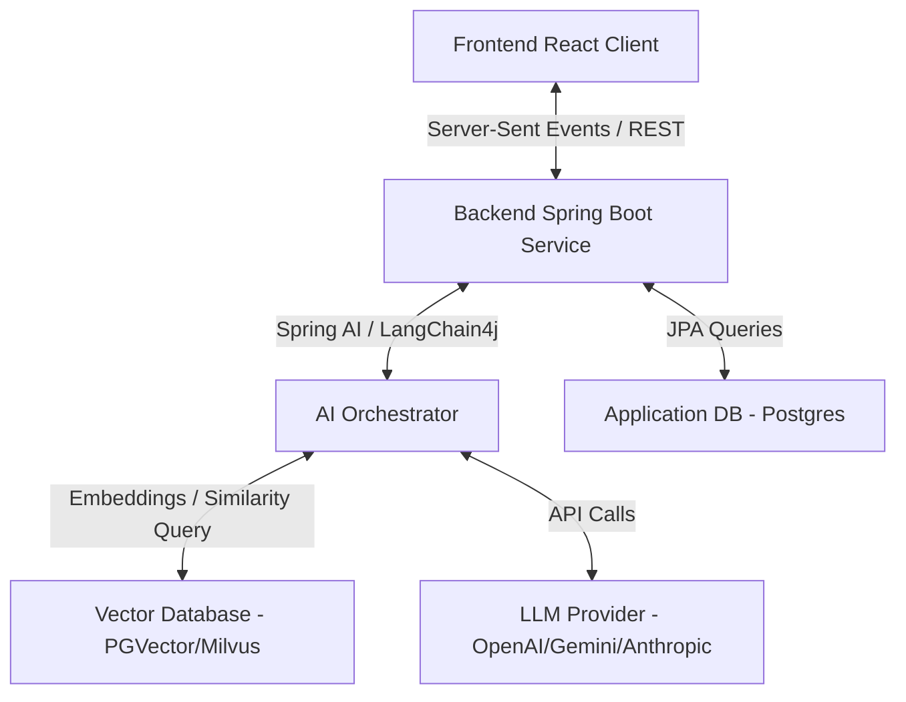

# Đề xuất Thiết kế Hệ thống Hỗ trợ Học tập thông qua AI Chatbot (AI Tutor)

Tài liệu này đề xuất chi tiết giải pháp thiết kế và tích hợp trợ lý ảo thông minh **AI Tutor** cho nền tảng học thuật toán AlgoTutor. Hệ thống bao gồm thiết kế giao diện người dùng (Frontend UI/UX) và các đặc tả API cần thiết (Backend API) để triển khai tích hợp AI thực tế (Sử dụng OpenAI/Claude hoặc các mô hình mã nguồn mở thông qua RAG).

---

## I. KIẾN TRÚC TỔNG QUAN HỆ THỐNG



---

## II. THIẾT KẾ PHÍA FRONTEND (FE DESIGN)

Trải nghiệm AI Chatbot ở Frontend sẽ được tối ưu hóa theo 2 dạng hiển thị:
1. **AI Chatbot Widget (Dashboard & Toàn trang):** Bong bóng trò chuyện nổi góc dưới bên phải, trợ giúp các câu hỏi chung, lộ trình, giải đáp thắc mắc tổng quát.
2. **Context-Aware Sidebar (Trang học tập - Learn):** Bảng bên phải tích hợp sâu vào bài học lý thuyết, trắc nghiệm và biên dịch code hiện tại.

### 1. Giao diện & Trải nghiệm Người dùng (UI/UX)
* **Chế độ hiển thị tin nhắn (Message Rendering):**
  * Hỗ trợ **Markdown** đầy đủ (in đậm, in nghiêng, danh sách, bảng dữ liệu).
  * Hỗ trợ **Syntax Highlighting** tự động cho các khối mã nguồn (sử dụng thư viện `react-markdown` kết hợp `prismjs` hoặc `monaco-editor` ở dạng read-only).
  * Khung copy code nhanh và nút "Áp dụng vào Trình soạn thảo" đối với bài tập code.
* **Luồng phản hồi dạng Stream (Streaming Message Effect):**
  * Sử dụng hiệu ứng con trỏ nhấp nháy (`typing-indicator`) và kết xuất nội dung thời gian thực khi dữ liệu truyền từ Backend về.
* **Gợi ý câu hỏi thông minh (Smart Actions / Quick Prompts):**
  * Hiển thị các nút gợi ý câu hỏi thay đổi động theo ngữ cảnh bài học.
  * Ví dụ bài tập Code: *"Gợi ý thuật toán O(N)"*, *"Kiểm tra lỗi biên dịch của tôi"*, *"Tối ưu không gian nhớ"*.
* **Nút bấm phản hồi lỗi nhanh (Instant Debug):**
  * Bên cạnh đầu ra của Trình biên dịch (khi chạy testcase bị lỗi), tích hợp nút *"Hỏi AI về lỗi này"* để tự động mở khung Chat và dán log lỗi kèm code hiện tại vào câu lệnh.

---

### 2. Các Component React Cần Xây Dựng/Tối Ưu
* **`AIChatWidget` (Mới):** Widget nổi toàn trang, quản lý trạng thái đóng/mở panel chat góc phải màn hình.
* **`AITutorPanel` (Tối ưu hóa từ bản Mock hiện tại):** 
  * Cập nhật từ nhận dữ liệu tĩnh sang gọi API streaming bằng `EventSource` (SSE).
  * Quản lý lịch sử trò chuyện theo từng `lessonSlug` riêng biệt, lưu trữ lịch sử tạm thời ở `localStorage` để giảm tải truy vấn hoặc lưu trữ đồng bộ với Database.

---

## III. THIẾT KẾ PHÍA BACKEND (BE API & ARCHITECTURE)

Hệ thống Backend được xây dựng bằng **Spring Boot**, sử dụng **Spring AI** hoặc **LangChain4j** để quản lý các mẫu Prompt, kết nối LLM và RAG (Retrieval-Augmented Generation).

### 1. Mô hình Dữ liệu (Database Schema)

Để lưu giữ cuộc trò chuyện của người dùng, cần thiết kế 2 bảng chính:

#### Bảng `ai_conversations` (Quản lý phiên trò chuyện)
* `id` (UUID, Primary Key)
* `user_id` (Long, Foreign Key, xác định người dùng)
* `lesson_slug` (String, Nullable - nếu trò chuyện trong một bài học cụ thể)
* `title` (String - Tiêu đề tóm tắt cuộc trò chuyện, tự động sinh từ tin nhắn đầu tiên)
* `created_at`, `updated_at` (Timestamp)

#### Bảng `ai_messages` (Chi tiết các tin nhắn trong phiên)
* `id` (UUID, Primary key)
* `conversation_id` (UUID, Foreign Key)
* `role` (Enum: `USER`, `ASSISTANT`, `SYSTEM`)
* `content` (Text - Nội dung tin nhắn dạng Markdown)
* `created_at` (Timestamp)

---

### 2. Đặc tả các API Đầu cuối (REST & SSE Endpoints)

Các API này sẽ được định nghĩa trong `AITutorController` phía Backend:

#### ① Khởi tạo trạng thái AI cho bài học (Bootstrap AI)
* **Endpoint:** `GET /api/v1/ai/bootstrap/{lessonSlug}`
* **Description:** Được gọi khi người dùng mở panel AI trong bài học lần đầu (hoặc reset chat) và lịch sử cuộc trò chuyện của bài học này trống. API sẽ trả về lời chào mừng cá nhân hóa và danh sách gợi ý hành động nhanh phù hợp nhất với loại bài học hiện tại để Frontend hiển thị động.
* **Response Body (`ApiResponse<AIBootstrapResponse>`):**
  ```json
  {
    "success": true,
    "message": "Khởi tạo trạng thái AI thành công",
    "data": {
      "welcomeMessage": "Xin chào! Tôi là **AI Tutor**, trợ lý học tập cá nhân của bạn trong bài học **Cấu trúc dữ liệu ngăn xếp**...",
      "quickActions": [
        {
          "label": "Giải thích đề bài",
          "icon": "LightbulbIcon",
          "prompt": "Bạn có thể giải thích yêu cầu của đề bài và các ví dụ một cách dễ hiểu hơn không?"
        },
        {
          "label": "Gợi ý hướng giải",
          "icon": "ZapIcon",
          "prompt": "Tôi đang bị bí. Bạn có thể cho tôi một gợi ý về hướng tiếp cận tối ưu mà không cho code giải được không?"
        }
      ]
    }
  }
  ```

#### ② Lấy danh sách lịch sử trò chuyện
* **Endpoint:** `GET /api/v1/ai/conversations`
* **Query Params:** `lessonSlug` (String, Optional - để lọc theo bài học)
* **Response Body:** `ApiResponse<List<AIConversationResponse>>`

#### ③ Tạo mới một phiên trò chuyện
* **Endpoint:** `POST /api/v1/ai/conversations`
* **Request Body:**
  ```json
  {
    "lessonSlug": "stack-implementation", // Optional
    "initialMessage": "Làm thế nào để cài đặt Stack bằng mảng?"
  }
  ```
* **Response Body:** `ApiResponse<AIConversationResponse>`

#### ④ Gửi tin nhắn và Nhận phản hồi dạng Stream (Server-Sent Events)
Để mang lại trải nghiệm mượt mà, máy chủ sẽ trả về nội dung dưới dạng luồng dữ liệu (Stream) thay vì đợi phản hồi đầy đủ từ mô hình ngôn ngữ lớn.
* **Endpoint:** `POST /api/v1/ai/conversations/{conversationId}/chat`
* **Headers:** `Accept: text/event-stream`
* **Request Body (Ngữ cảnh chi tiết gửi kèm):**
  ```json
  {
    "message": "Tại sao code của tôi bị lỗi Time Limit Exceeded?",
    "context": {
      "lessonSlug": "two-sum",
      "lessonType": "CODING",
      "userCode": "public int[] twoSum(int[] nums, int target) { ... }", // Code hiện tại ở editor
      "compilerError": "Time Limit Exceeded on Testcase 4", // Lỗi biên dịch nếu có
      "language": "java"
    }
  }
  ```
* **Response Stream (SSE events):**
  ```text
  event: message
  data: {"chunk": "Chào"}

  event: message
  data: {"chunk": " bạn. Lỗi"}

  event: message
  data: {"chunk": " Time Limit Exceeded xảy ra do..."}

  event: done
  data: {"messageId": "msg-uuid-1234"}
  ```

#### ⑤ Xóa lịch sử phiên trò chuyện
* **Endpoint:** `DELETE /api/v1/ai/conversations/{conversationId}`
* **Response Body:** `ApiResponse<Void>`

---

## IV. NGUYÊN TẮC THIẾT KẾ PROMPT (PROMPT ENGINEERING FOR EDUCATION)

Để AI hoạt động thực sự như một **Gia sư giải thuật (Tutor)** thay vì một công cụ giải bài hộ (Solver), hệ thống cần áp dụng chỉ thị hệ thống (**System Prompt**) cực kỳ nghiêm ngặt:

1. **Không đưa ra lời giải trực tiếp:** Khi người dùng hỏi code giải, AI tuyệt đối không được viết code hoàn chỉnh. Thay vào đó, AI cần giải thích hướng tiếp cận, đưa ra giả mã (pseudocode) hoặc gợi ý thuật toán.
2. **Gợi mở tư duy từng bước (Socratic Method):** Đặt câu hỏi ngược lại cho người dùng để kích thích tư duy, ví dụ: *"Bạn đã nghĩ đến việc sắp xếp mảng trước chưa?"* hoặc *"Độ phức tạp hiện tại là O(N^2), bạn có thể dùng mảng đánh dấu hoặc HashMap để đưa về O(N) không?"*.
3. **Phân tích lỗi cụ thể:** Khi có lỗi biên dịch (`compilerError`), chỉ rõ dòng code có khả năng lỗi và giải thích cơ chế gây ra lỗi đó (Ví dụ: Off-by-one, NullPointer, StackOverflow).
