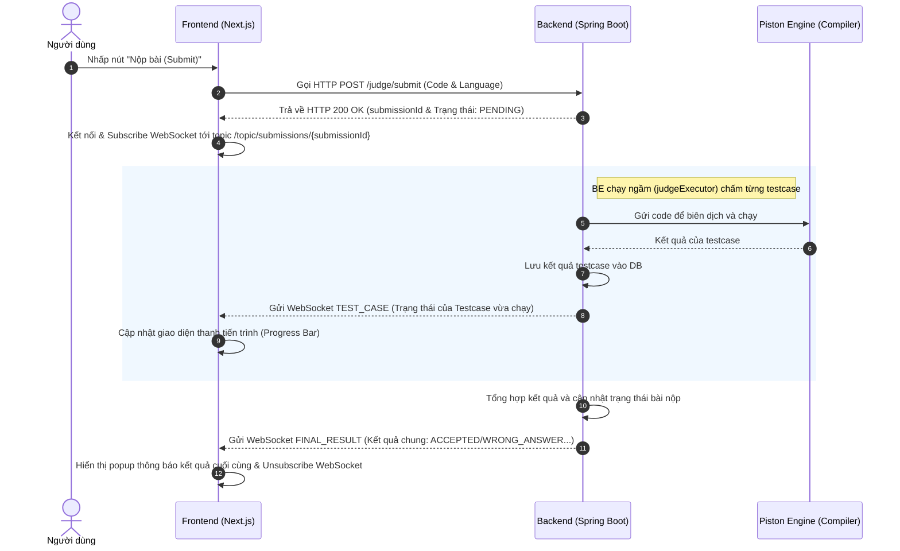

# Hướng dẫn Tích hợp Frontend: Luồng Submit Code & Nhận Kết quả Real-time

Tài liệu này hướng dẫn chi tiết cách Frontend (Next.js/React) tích hợp với Backend thông qua REST API Submit và STOMP WebSocket để hiển thị kết quả chấm bài real-time cho người dùng.

---

## 1. Tổng quan Luồng hoạt động (Workflow)



---

## 2. Bước 1: Gửi yêu cầu nộp bài (REST API)

Khi người dùng nhấn **Submit**, Frontend gửi code lên API để khởi tạo phiên chấm bài.

### Yêu cầu HTTP
- **URL**: `/judge/submit`
- **Method**: `POST`
- **Headers**:
  - `Content-Type: application/json`

### Request Body (Payload)
```json
{
  "lessonSlug": "two-sum",
  "language": "JAVA",
  "code": "class Solution {\n    public int[] twoSum(int[] nums, int target) {\n        // Code của người dùng\n    }\n}"
}
```
*Lưu ý về các giá trị `language` hợp lệ*: `JAVA`, `PYTHON`, `CPP`, `C`, `JAVASCRIPT`, `TYPESCRIPT` (theo Enum `ProgrammingLanguage` ở Backend).

### Response Body
Hệ thống sẽ trả về mã `200` ngay lập tức cùng với một `submissionId` và trạng thái `PENDING`:
```json
{
  "code": 200,
  "message": "Thành công",
  "data": {
    "submissionId": "3fa85f64-5717-4562-b3fc-2c963f66afa6",
    "verdict": "PENDING",
    "summary": null,
    "performance": null,
    "testCaseResults": null,
    "compileError": null,
    "completed": false
  }
}
```

---

## 3. Bước 2: Kết nối WebSocket & Subscribe kết quả bài nộp

Ngay khi nhận được `submissionId` từ API trên, Frontend phải:
1. Kết nối tới server STOMP WebSocket (nếu chưa kết nối).
2. Đăng ký nhận tin nhắn (Subscribe) từ topic riêng của submission đó.

### Cấu hình kết nối
- **WebSocket Endpoint**: `ws://localhost:8080/ws` (hoặc `wss://<api-domain>/ws` ở môi trường production).
- **Topic cần Subscribe**: `/topic/submissions/{submissionId}`

### Ví dụ code Client (Sử dụng `@stomp/stompjs` hoặc `sockjs-client`)

Cài đặt thư viện:
```bash
npm install @stomp/stompjs
```

Đoạn code React/Next.js mẫu:
```typescript
import { Client } from '@stomp/stompjs';

const connectAndSubscribe = (submissionId: string, onEvent: (msg: any) => void) => {
  const client = new Client({
    brokerURL: 'ws://localhost:8080/ws',
    connectHeaders: {
      // Nếu WebSocket yêu cầu JWT Auth (hiện tại backend cho phép handshake công khai)
      // Authorization: 'Bearer ' + token 
    },
    debug: function (str) {
      console.log('STOMP Debug:', str);
    },
    reconnectDelay: 5000,
    heartbeatIncoming: 4000,
    heartbeatOutgoing: 4000,
  });

  client.onConnect = (frame) => {
    console.log('Đã kết nối thành công tới WebSocket!');
    
    // Subscribe vào topic riêng của submission
    const topic = `/topic/submissions/${submissionId}`;
    const subscription = client.subscribe(topic, (message) => {
      if (message.body) {
        const payload = JSON.parse(message.body);
        onEvent(payload);
      }
    });
  };

  client.onStompError = (frame) => {
    console.error('Lỗi kết nối STOMP:', frame.headers['message']);
  };

  client.activate();

  // Trả về hàm cleanup để disconnect khi component unmount
  return () => {
    client.deactivate();
  };
};
```

---

## 4. Bước 3: Xử lý dữ liệu nhận từ WebSocket

Có 2 định dạng Payload sẽ được gửi về Topic `/topic/submissions/{submissionId}` phân biệt qua trường `type`:

### A. Sự kiện cập nhật testcase (`type: "TEST_CASE"`)
Được gửi liên tục sau khi chấm xong từng testcase. Frontend dùng dữ liệu này để hiển thị thanh tiến trình chạy (ví dụ: `Đang chạy testcase 3/10 (ACCEPTED)...`).

**Payload mẫu**:
```json
{
  "type": "TEST_CASE",
  "submissionId": "3fa85f64-5717-4562-b3fc-2c963f66afa6",
  "testCaseId": 15,
  "status": "ACCEPTED",
  "runTimeMs": 12,
  "sortOrder": 1,
  "isCompleted": false
}
```

* **Trường dữ liệu cần quan tâm**:
  * `status`: Trạng thái của testcase (`ACCEPTED`, `WRONG_ANSWER`, `RUNTIME_ERROR`, `TIME_LIMIT_EXCEEDED`, `MEMORY_LIMIT_EXCEEDED`, `COMPILATION_ERROR`, `SYSTEM_ERROR`).
  * `sortOrder`: Thứ tự của testcase (giúp xác định vị trí để sáng xanh/sáng đỏ trên UI).
  * `isCompleted`: Nếu là `true`, nghĩa là toàn bộ tiến trình chấm bài đã dừng sớm (ví dụ gặp lỗi ngay testcase đầu tiên và dừng luôn).

---

### B. Sự kiện kết quả tổng kết (`type: "FINAL_RESULT"`)
Được gửi một lần duy nhất khi toàn bộ các testcase đã hoàn tất chấm điểm hoặc bị ngắt sớm do gặp lỗi. Khi nhận được tin này, Frontend hiển thị kết quả cuối cùng cho người dùng và tiến hành ngắt kết nối WebSocket.

**Payload mẫu**:
```json
{
  "type": "FINAL_RESULT",
  "submissionId": "3fa85f64-5717-4562-b3fc-2c963f66afa6",
  "status": "ACCEPTED",
  "isCompleted": true
}
```

* **Trường dữ liệu cần quan tâm**:
  * `status`: Verdict tổng kết của bài nộp. Nếu là `ACCEPTED`, bài nộp đã vượt qua toàn bộ testcase và hệ thống đã ghi nhận hoàn thành bài học thành công.
  * Lúc này, Frontend nên ngắt subscribe WebSocket của submissionId để giải phóng tài nguyên client.

---

## 5. Danh sách các Trạng thái (`status` / `Verdict`)
Frontend nên chuẩn bị bảng màu sắc tương ứng cho từng trạng thái:

| Trạng thái | Ý nghĩa | Màu sắc gợi ý (Tailwind) |
| :--- | :--- | :--- |
| `PENDING` | Bài nộp đang chờ được xếp lịch chấm. | `text-gray-500` / `bg-gray-100` |
| `ACCEPTED` (AC) | Bài làm hoàn toàn chính xác. | `text-green-500` / `bg-green-50` |
| `WRONG_ANSWER` (WA) | Kết quả đầu ra không khớp với đáp án mẫu. | `text-red-500` / `bg-red-50` |
| `COMPILATION_ERROR` (CE) | Mã nguồn bị lỗi cú pháp, không thể biên dịch. | `text-yellow-600` / `bg-yellow-50` |
| `RUNTIME_ERROR` (RE) | Lỗi phát sinh lúc chạy bài (ví dụ NullPointer, DivisionByZero). | `text-orange-500` / `bg-orange-50` |
| `TIME_LIMIT_EXCEEDED` (TLE) | Code chạy quá thời gian tối đa cho phép của bài học. | `text-purple-500` / `bg-purple-50` |
| `MEMORY_LIMIT_EXCEEDED` (MLE) | Sử dụng quá dung lượng bộ nhớ cho phép. | `text-indigo-500` / `bg-indigo-50` |
| `SYSTEM_ERROR` | Lỗi phát sinh từ hệ thống chấm điểm Piston hoặc Sandbox. | `text-gray-700` / `bg-gray-200` |
